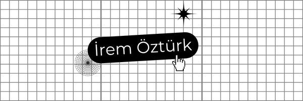

# Hi, I'm İrem Öztürk 👩‍💻

Computer Engineering student building **AI-powered and modern web applications** for real-world problems.

---

## 🚀 About Me
- 🎓 4th-year Computer Engineering student  
- 🤖 Focused on AI, Computer Vision & Deep Learning  
- 🌐 Developing scalable web applications  
- 📊 Interested in data-driven and real-world impact projects  

---

## 🧠 Tech Stack
**AI / Data:** PyTorch, TensorFlow, OpenCV  
**Web:** React, Next.js, TypeScript, TailwindCSS  
**Languages:** Python, JavaScript, C/C++  
**Tools:** Git, Colab, Figma  

---

## 📌 Featured Work
- 🫁 **3D Lung Lesion Segmentation** – Deep learning for medical imaging  
- 🧏‍♀️ **Sign Language System** – AI-based accessibility project  
- 🌍 **Optimus World Time** – Modern responsive web app  
- 📊 **Student Stress Analysis** – ML & data analysis  

---

## 📫 Connect
- LinkedIn: https://www.linkedin.com/in/irem-ozturkkk  
- Medium: https://medium.com/@iremm.ozturkk.tr  

---
